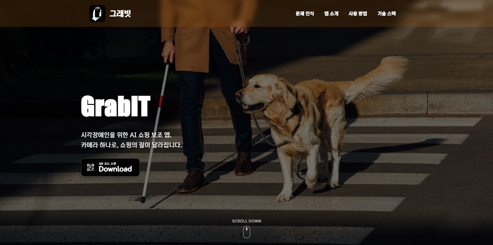

  <h1>GrabIT - 시각장애인을 위한 AI 보조 서비스</h1>
  
🔍 AI 기반 객체 인식 및 정보 제공 서비스 🔍

 

  

 

  <a href="https://grab-it.duckdns.org/">🖥️ 웹사이트</a>
  &nbsp; | &nbsp;
  <a href="https://github.com/KDT-GrabIT/GrabIT-Android">⚙️ Android Repo</a>
  &nbsp; | &nbsp;
  <a href="https://www.notion.so/GrabIT-2e6441f66d7881b487d7d4e07a299fa6?source=copy_link">Notion</a>

---

## ✍️ 프로젝트 개요

- **프로젝트명:** GrabIT
- **프로젝트 기간:** 2026.01 ~ 2026.03
- **프로젝트 형태:** KDT 국비 지원 프로그램 프로젝트
- **목표:** 시각장애인이 주변 사물을 인식하고 필요한 정보를 직관적으로 얻을 수 있도록 돕는 모바일 애플리케이션 개발
- **주요 타겟 사용자:** 시각장애인 및 저시력자

---

## ✍️ 프로젝트 소개

### 프로젝트 배경

시각장애인이 일상생활에서 겪는 정보 접근성의 한계를 극복하기 위해 다음과 같은 문제에 집중했습니다.

1. **점자 표기의 한계:** - 현재 많은 상품에 점자가 표기되어 있으나, '음료', '컵라면' 등 단순 카테고리만 안내하는 경우가 많습니다.
   - 구체적인 브랜드명, 맛, 용량 등 **디테일한 상품 정보**가 점자에는 포함되어 있지 않아 원하는 물건을 정확히 고르기 어렵습니다.

2. **정보 접근의 비효율성:** - 점자가 없는 상품의 경우 주변의 도움 없이는 정보를 확인하기 불가능합니다.
   - 점자를 일일이 만져서 확인하는 과정은 시간이 오래 걸리며, 많은 상품 속에서 특정 제품을 찾기에 제약이 큽니다.

**GrabIT**은 이러한 문제를 해결하기 위해 AI 객체 인식 기술과 음성 안내를 결합하여 사용자의 '눈'이 되어주는 서비스입니다.

---

## 🚀 프로젝트 목표

1. **업무 효율성 및 독립성 향상:** - 시각장애인이 보조자 없이도 주변 정보를 스스로 획득하여 일상적인 활동을 신속하게 수행.
2. **사용자 경험(UX) 최적화:** - VoiceOver 및 제스처 기반의 직관적인 인터페이스를 통해 높은 사용 편의성 제공.
3. **온디바이스 AI 최적화:** - 모바일 환경에서 지연 시간 없는 실시간 인식을 위한 경량화 모델 구현.

---

## 📌 주요 기능

### **1. 실시간 상세 상품 인식**
- **기능 설명:** 카메라에 담긴 상품을 분석하여 점자로는 확인 불가능한 상세 제품명을 음성으로 안내합니다.
- **기술 요소:** **YOLOX** 기반 Object Detection.

### **2. 핸드 트래킹 기반 타겟 지정**
- **기능 설명:** 사용자의 손가락 끝 위치를 추적하여, 현재 사용자가 만지거나 가리키고 있는 상품의 정보를 우선적으로 알려줍니다.
- **기술 요소:** **MediaPipe Hands** 기반 Hand Tracking.

### **3. 저지연 모바일 추론**
- **기능 설명:** 복잡한 서버 연산 없이 모바일 기기 자체에서 빠르게 추론하여 사용자에게 즉각적인 피드백을 전달합니다.
- **기술 요소:** **LiteRT (TFLite)** 및 **OpenCV** 기반 영상 처리.

---

## 🧑‍💻 팀원 소개

| **이름** | **역할** | 
|:-----------:|:---------------:|
| 김대영      | 팀장 & Vision Pipeline 설계   | 
| 박조영      | AI학습 & 안드로이드 개발       |
| 이태윤      | BE & 안드로이드 개발          | 
| 정마나미    | AI학습 & 웹 UI/UX             | 

---

## ⚙️ 기술 스택

<table>
  <thead>
    <tr>
      <th>분류</th>
      <th>기술 스택</th>
    </tr>
  </thead>
  <tbody>
    <tr>
      <td>AI / Computer Vision</td>
      <td>
        
        
        
        
      </td>
    </tr>
    <tr>
      <td>Backend</td>
      <td>
        
        
        
      </td>
    </tr>
    <tr>
      <td>Mobile</td>
      <td>
        
        
        
        
      </td>
    </tr>
    <tr>
      <td>DevOps / 협업</td>
      <td>
        
        
        
        
        
      </td>
    </tr>
  </tbody>
</table>

---

## 📂 문서 자료

- [System Architecture](https://www.figma.com/board/EVha4eWHn9s1h4OSaTpEup/%EC%8B%9C%EC%8A%A4%ED%85%9C-%EC%95%84%ED%82%A4%ED%85%8D%EC%B3%90_GrabIT?node-id=0-1&t=t1bTLLkPl8ik8hA9-1)
- [JIRA](https://idy970829.atlassian.net/jira/software/projects/PP/boards/34/timeline?atlOrigin=eyJpIjoiYWZlNTVlOTBmNTQ2NDE3NGIzODJiY2Y0NmY3YmJiYWMiLCJwIjoiaiJ9)
- [발표 자료](https://drive.google.com/file/d/1B2HmXxyrdvjn2sgS76vhdfM6bQE7WF2M/view?usp=sharing)
